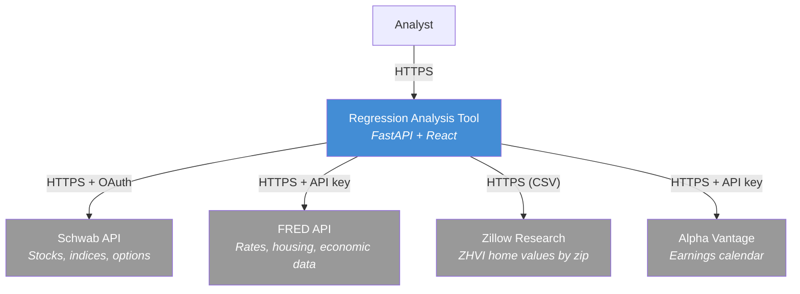
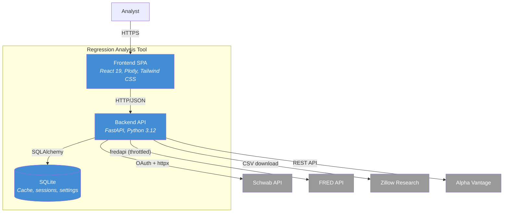
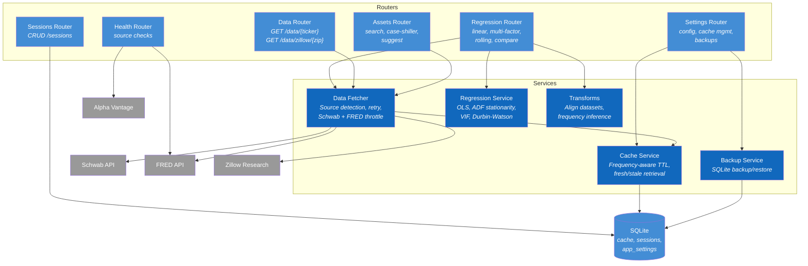
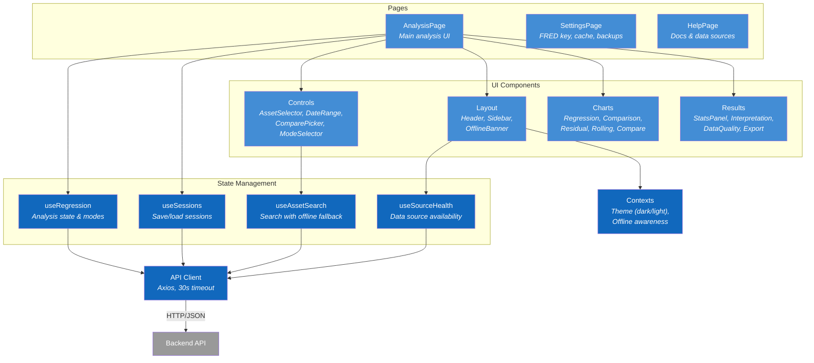

# Financial Regression Analysis Tool

A full-stack application for financial data analysis with linear, multi-factor, rolling, and comparison regression models. Fetches data from Schwab, FRED, Zillow, and Alpha Vantage, caches it locally, and presents interactive Plotly charts with statistical summaries.


## Features

- **Linear Regression** — Price vs time trend with confidence intervals
- **Multi-Factor Regression** — OLS with automatic frequency alignment across data sources
- **Rolling Regression** — Sliding window trend analysis with auto-annotated trend breaks
- **Comparison Mode** — Normalize 2-5 assets to a common base for side-by-side analysis
- **Real Estate Analysis** — Case-Shiller metro indices and Zillow zip code data
- **Session Management** — Save, reload, and share analysis configurations
- **Chart Annotations** — Add custom notes to chart dates
- **Data Quality Indicators** — Source badges, staleness warnings, alignment notes
- **Plain-English Interpretation** — Auto-generated summaries of statistical results
- **Dark Mode** — Full dark/light theme support
- **Export** — CSV data export and Plotly chart image export

## Prerequisites

- **Docker** and **Docker Compose** (recommended), or:
  - Python 3.12+
  - Node.js 20+
- **FRED API Key** (free) — [Get one here](https://fred.stlouisfed.org/docs/api/api_key.html)
  - Required for interest rates, housing indices, and economic data
- **Schwab API credentials** — Required for stock/index/commodity data and options scanning
- **Alpha Vantage API Key** (free, optional) — [Get one here](https://www.alphavantage.co/support/#api-key)
  - Used for earnings calendar data (25 requests/day on free tier)
  - Options scanner works without it but won't exclude earnings-adjacent expirations

## Quick Start (Docker)

```bash
# Clone the repository
git clone <repo-url> regression_tool
cd regression_tool

# Set up environment variables
cp backend/.env.example backend/.env
# Edit backend/.env and add your keys:
#   FRED_API_KEY        — required for economic data (https://fred.stlouisfed.org/docs/api/api_key.html)
#   SCHWAB_APP_KEY      — required for market data (register at https://developer.schwab.com)
#   SCHWAB_APP_SECRET   — required for market data
#   ALPHA_VANTAGE_API_KEY — optional, for earnings calendar (https://www.alphavantage.co/support/#api-key)

# Build and run
docker-compose up --build

# Frontend: http://localhost:3000
# Backend API: http://localhost:8000
# API docs: http://localhost:8000/docs
```

## Development Setup (without Docker)

### Backend

```bash
cd backend
python3 -m venv .venv
source .venv/bin/activate
pip install -r requirements.txt

# Set up environment
cp .env.example .env
# Edit .env with your FRED API key

# Run
uvicorn app.main:app --reload
# API available at http://localhost:8000
```

### Frontend

```bash
cd frontend
npm install
npm run dev
# App available at http://localhost:3000
# Vite proxies /api/* to localhost:8000
```

### Running Tests

```bash
cd backend
source .venv/bin/activate
pytest tests/ -v
```

## Architecture

### System Context



### Container Diagram



### Backend Components



### Frontend Components



### Key Design Decisions

| Decision | Detail |
|---|---|
| **Cache-first fetching** | All data checks SQLite cache before calling external APIs |
| **Frequency-aware TTL** | Daily data cached 24h, monthly/quarterly cached 7 days |
| **Stale fallback** | If API fails after retries, serves stale cache with `is_stale` flag |
| **Schwab market data** | OAuth-authenticated access to Schwab API for quotes and options |
| **FRED throttle** | Thread-safe 500ms minimum interval between calls |
| **Exponential backoff** | 3 attempts with 2-10s waits (Schwab) and 1-4s waits (FRED) |
| **Stationarity checks** | ADF test + auto-differencing for non-stationary series |

### Project Structure

```
regression_tool/
├── backend/                    # Python/FastAPI
│   ├── app/
│   │   ├── main.py             # App entry, lifespan, CORS, error handlers
│   │   ├── config.py           # Settings (pydantic-settings)
│   │   ├── routers/            # API endpoints
│   │   │   ├── assets.py       # Asset search, Case-Shiller list, suggestions
│   │   │   ├── data.py         # Historical data (auto-detect source)
│   │   │   ├── regression.py   # Linear, multi-factor, rolling, compare
│   │   │   ├── sessions.py     # CRUD for saved sessions
│   │   │   └── settings.py     # App settings, cache management
│   │   ├── services/
│   │   │   ├── data_fetcher.py # Schwab/FRED/Zillow with cache + retry
│   │   │   ├── regression.py   # Regression computation engines
│   │   │   └── cache.py        # SQLite cache with freshness rules
│   │   ├── models/
│   │   │   ├── database.py     # SQLAlchemy models
│   │   │   └── schemas.py      # Pydantic request/response schemas
│   │   └── utils/
│   │       └── transforms.py   # Dataset alignment, frequency detection
│   └── tests/
├── frontend/                   # React + Vite
│   ├── src/
│   │   ├── api/client.js       # Axios API wrapper
│   │   ├── components/
│   │   │   ├── layout/         # Header, Sidebar, Layout, LoadingSkeleton
│   │   │   ├── controls/       # AssetSelector, DateRangePicker, ComparePicker, etc.
│   │   │   ├── charts/         # Plotly charts for each regression mode
│   │   │   ├── results/        # StatsPanel, Interpretation, Annotations, Export
│   │   │   ├── sessions/       # Save/load sessions
│   │   │   └── settings/       # Settings page, Setup wizard
│   │   ├── hooks/              # useRegression, useAssetSearch, useSessions
│   │   ├── context/            # ThemeContext (dark/light mode)
│   │   └── utils/              # Formatters, CSV export
│   └── nginx.conf              # Production SPA + API proxy config
└── docker-compose.yml
```

## API Documentation

When the backend is running, interactive API docs are available at:

- **Swagger UI**: [http://localhost:8000/docs](http://localhost:8000/docs)
- **ReDoc**: [http://localhost:8000/redoc](http://localhost:8000/redoc)

### Key Endpoints

| Method | Endpoint | Description |
|--------|----------|-------------|
| GET | `/api/health` | Health check |
| GET | `/api/assets/search?q=` | Search assets |
| GET | `/api/data/{ticker}` | Historical data |
| POST | `/api/regression/linear` | Linear regression |
| POST | `/api/regression/multi-factor` | Multi-factor OLS |
| POST | `/api/regression/rolling` | Rolling regression |
| POST | `/api/regression/compare` | Compare assets |
| GET | `/api/settings` | App settings |

## Tech Stack

**Backend**: Python 3.12, FastAPI, SQLAlchemy, SQLite, httpx, fredapi, statsmodels, scipy, pandas, tenacity

**Frontend**: React 18, Vite, Tailwind CSS, Plotly.js, Axios, React Router, react-datepicker, react-hot-toast

**Infrastructure**: Docker, nginx, Docker Compose

## Production Deployment

Deploy to a single VPS (Hetzner, DigitalOcean, or similar) with automatic HTTPS via Caddy.

**Estimated cost:** $4.50–6/month for a small VPS with 2GB+ RAM.

### Prerequisites

- A VPS with 2GB+ RAM running Ubuntu/Debian
- A domain name (e.g., `regression.yourdomain.com`)
- DNS A record pointing your domain to the server's IP address
- A FRED API key ([get one free](https://fred.stlouisfed.org/docs/api/api_key.html))

### Deploy to a fresh server

```bash
# SSH into your server
ssh root@your-server-ip

# Clone the repo
git clone <repo-url> /opt/regression-tool
cd /opt/regression-tool

# Run the deploy script
sudo bash deploy/deploy.sh
```

The script will:
- Install Docker and configure the firewall (UFW)
- Prompt for your domain name, FRED API key, and optional basic auth credentials
- Build and start all containers (Caddy + backend + frontend)
- Print your live URL when done

### Update to latest version

```bash
cd /opt/regression-tool
bash deploy/update.sh
```

Pulls latest code, rebuilds containers, and cleans up old images.

### Backup the database

```bash
cd /opt/regression-tool
bash deploy/backup.sh
```

Creates a timestamped copy of the SQLite database and prints an `scp` command to download it.

### Check status

```bash
cd /opt/regression-tool
bash deploy/status.sh
```

Shows container health, resource usage, HTTPS cert expiry, and recent backend logs.

### Friends-only access (basic auth)

To restrict access to your group, add these to your `.env` file:

```
BASIC_AUTH_USER=myusername
BASIC_AUTH_PASS=mypassword
```

Then restart Caddy:

```bash
docker compose -f docker-compose.prod.yml restart caddy
```

To remove basic auth, delete those lines from `.env` and restart Caddy.

### DNS setup

Create an **A record** in your DNS provider:

| Type | Name | Value |
|------|------|-------|
| A | regression (or your subdomain) | Your server's IP address |

Caddy will automatically obtain and renew HTTPS certificates from Let's Encrypt once DNS is pointing correctly.

### Architecture (production)

```
Internet → Caddy (HTTPS, :80/:443)
              ├── /api/*  → Backend (FastAPI, internal only)
              └── /*      → Frontend (nginx, internal only)
```

Backend port 8000 is **not** exposed to the internet — only Caddy can reach it via Docker's internal network.

## Contributing

1. Fork the repository
2. Create a feature branch (`git checkout -b feature/my-feature`)
3. Make your changes
4. Run tests (`pytest tests/ -v`)
5. Commit and push
6. Open a Pull Request
