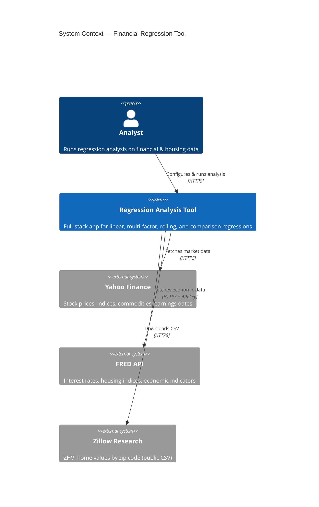
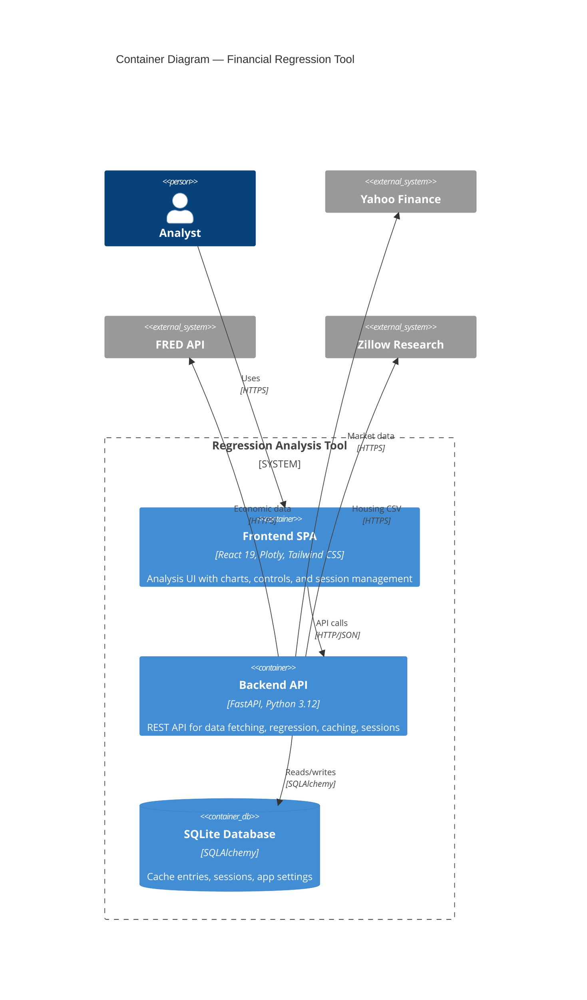
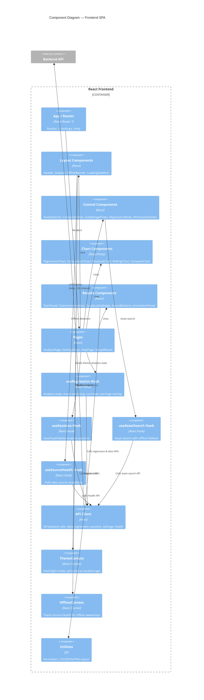

# C4 Component Diagram — Regression Analysis Tool

## System Context (Level 1)



## Container Diagram (Level 2)



## Component Diagram — Backend (Level 3)

```mermaid
C4Component
    title Component Diagram — Backend API

    Container_Boundary(api, "FastAPI Backend") {

        Component(reg_router, "Regression Router", "FastAPI Router", "POST /api/regression/{linear,multi-factor,rolling,compare}")
        Component(data_router, "Data Router", "FastAPI Router", "GET /api/data/{ticker}, /api/data/zillow/{zip}")
        Component(asset_router, "Assets Router", "FastAPI Router", "GET /api/assets/{search,case-shiller,suggest}")
        Component(session_router, "Sessions Router", "FastAPI Router", "CRUD /api/sessions")
        Component(settings_router, "Settings Router", "FastAPI Router", "GET/PUT /api/settings, cache mgmt, backups")
        Component(health_router, "Health Router", "FastAPI Router", "GET /api/health/sources")

        Component(reg_service, "Regression Service", "Python/SciPy/statsmodels", "Linear, OLS multi-factor, rolling regressions with ADF, VIF, Durbin-Watson diagnostics")
        Component(data_fetcher, "Data Fetcher", "Python/yfinance/fredapi", "Unified fetch with source detection, retry, dual Yahoo endpoints, FRED throttle")
        Component(cache_service, "Cache Service", "Python/SQLAlchemy", "Frequency-aware TTL, fresh/stale retrieval, upsert")
        Component(backup_service, "Backup Service", "Python", "SQLite file backup and restore")
        Component(transforms, "Transforms", "Python/Pandas", "Dataset alignment, frequency inference, time indexing")

        Component(schemas, "Schemas", "Pydantic", "Request/response models for all endpoints")
        Component(config, "Config", "Pydantic Settings", "FRED key, DB URL, cache TTLs")
    }

    ContainerDb(db, "SQLite", "", "cache, sessions, app_settings tables")
    System_Ext(yahoo, "Yahoo Finance")
    System_Ext(fred, "FRED API")
    System_Ext(zillow, "Zillow Research")

    Rel(reg_router, reg_service, "Calls")
    Rel(reg_router, data_fetcher, "Fetches data")
    Rel(reg_router, transforms, "Aligns datasets")
    Rel(data_router, data_fetcher, "Fetches data")
    Rel(asset_router, data_fetcher, "Uses ASSET_REGISTRY")
    Rel(session_router, db, "CRUD sessions")
    Rel(settings_router, db, "Read/write settings")
    Rel(settings_router, cache_service, "Cache stats/clear")
    Rel(settings_router, backup_service, "Backup/restore")
    Rel(health_router, yahoo, "Health check")
    Rel(health_router, fred, "Health check")
    Rel(health_router, zillow, "Health check")

    Rel(data_fetcher, cache_service, "Cache-first lookup, stale fallback")
    Rel(data_fetcher, yahoo, "yfinance lib + direct query1 API")
    Rel(data_fetcher, fred, "fredapi with 500ms throttle")
    Rel(data_fetcher, zillow, "Downloads public CSV")
    Rel(cache_service, db, "Read/write cache entries")
    Rel(config, db, "Reads FRED key from app_settings")
```



## Component Diagram — Frontend (Level 3)



## Data Flow Summary

```
User → Frontend SPA → API Client (Axios)
                            │
                            ▼
                     FastAPI Backend
                     ┌──────────────────────────┐
                     │  Routers                  │
                     │  ├─ regression (4 modes)  │
                     │  ├─ data (ticker/zillow)  │
                     │  ├─ assets (search)       │
                     │  ├─ sessions (CRUD)       │
                     │  ├─ settings (config)     │
                     │  └─ health (source check) │
                     │                           │
                     │  Services                 │
                     │  ├─ DataFetcher           │──→ Yahoo Finance (dual endpoint + retry)
                     │  │   ├─ cache-first       │──→ FRED API (throttled 500ms + retry)
                     │  │   └─ stale fallback    │──→ Zillow CSV (retry)
                     │  ├─ RegressionService     │
                     │  │   └─ ADF/VIF/DW tests  │
                     │  ├─ CacheService          │──→ SQLite (cache table)
                     │  └─ Transforms            │
                     │       └─ align datasets   │
                     └──────────────────────────┘
```

## Key Architectural Decisions

| Decision | Detail |
|---|---|
| **Cache-first** | All data fetches check SQLite cache before hitting external APIs |
| **Frequency-aware TTL** | Daily data: 24h, Monthly/quarterly: 7 days |
| **Stale fallback** | If API fails after retries, serve stale cached data with `is_stale` flag |
| **Dual Yahoo endpoints** | yfinance library (query2) → direct API (query1) fallback |
| **FRED throttle** | Thread-safe 500ms minimum interval between FRED calls |
| **Exponential backoff** | tenacity: 3 attempts, 2-10s waits (Yahoo), 1-4s waits (FRED/Zillow) |
| **Concurrency cap** | ThreadPoolExecutor(max_workers=4) for Yahoo fetches |
| **Stationarity checks** | ADF test + auto-differencing for non-stationary time series |
| **Production deploy** | Docker Compose + Caddy reverse proxy with auto-SSL |
