# Implementation Plan: Issue #114 — Unified Dashboard

- **Issue:** [#114 — Add a unified Dashboard as the default landing route](https://github.com/ssandy33/regress/issues/114)
- **Date:** 2026-05-05
- **Author:** CTO agent
- **Companion docs:** `dashboard-114.md` (spec), `dashboard-114-mock.html` (visual)
- **Status:** Approved spec; this plan is the developer hand-off
- **Strategy:** Single PR (per CLAUDE.md "one issue per PR"), executed in the commit order below

---

## 1. Resolved open questions (from the issue thread)

The user's reply on the design spec resolved §11:

| Q  | Decision                                                                                  |
|----|--------------------------------------------------------------------------------------------|
| Q1 | **Extract** `Card`, `StatCard`, `StatusPill`, `EmptyState` into `components/common/` in *this* PR (not deferred) |
| Q2 | Move current `/` (Analysis) to `/analysis`, add an Analysis link in the header             |
| Q3 | Decision row = asymmetric `lg:grid-cols-12` with Expirations spanning 7 cols, Open Legs 5 |
| Q4 | Plain text for `P`/`C` in Open Legs; colored leading icon (⚠/●) only on Expirations card  |
| Q5 | Four-tag DTE heuristic: `roll-or-assign` / `manage` / `watch` / `hold`                    |
| Q6 | Recent Activity v0 = sessions + journal trades + Schwab imports; **no scanner runs**      |
| Q7 | Positions card always renders Unrealized P/L column; show `—` when null                   |
| Q8 | "Last sync" pulls from `data_meta.fetched_at`, not page render time                       |

Implementation must respect all of these.

---

## 2. Approach summary

A new `GET /api/dashboard` endpoint composes existing services (journal, schwab quotes, settings/health, sessions, cache) into a single payload. The frontend adds a `/dashboard` route, makes it the default authenticated landing page via Next.js `middleware.js`, relocates Analysis to `/analysis`, and renders nine new dashboard components on top of four newly-extracted shared components in `components/common/`.

Backend ships first (commits 1–4) so the frontend has a stable contract; shared components ship next (commit 5) so the page-level work (commits 6–10) only consumes them. Final commit (11) wires routing + Playwright e2e.

**Why one PR rather than two:** the routing change at `/` is part of the AC and breaks if the frontend pieces don't all land together (a partial PR with the redirect but without the dashboard route would 404).

---

## 3. Order of work

```mermaid
flowchart LR
  A[1. Service helpers<br/>app/services/dashboard.py] --> B[2. Pydantic schemas<br/>schemas.py]
  B --> C[3. Router<br/>routers/dashboard.py + main.py wiring]
  C --> D[4. Backend tests<br/>test_integration_dashboard.py]
  D --> E[5. Shared components<br/>components/common/*]
  E --> F[6. Hook + API client<br/>useDashboard + getDashboard]
  F --> G[7. Page shell + StatusStrip + KpiRow]
  G --> H[8. Decision-row cards<br/>Expirations + OpenLegs]
  H --> I[9. Below-fold cards<br/>Positions + Activity + ReadinessDetail + Onboarding]
  I --> J[10. Route move<br/>app/page.jsx -> app/analysis/page.jsx]
  J --> K[11. Header nav + middleware redirect + Playwright e2e]
```



Each box is a single commit. The implementer should not reorder — every step assumes its predecessors landed.

---

## 4. Backend

### 4.1 New files

| File | Purpose |
|---|---|
| `backend/app/services/dashboard.py` | Single composition function `build_dashboard_payload(db)` that calls existing services and returns a dict matching the response schema. **Does not duplicate health/settings logic** — it imports the existing helpers. |
| `backend/app/services/dashboard_legs.py` | Pure helpers: `derive_open_legs(positions)`, `compute_decision_tag(dte, moneyness_state)`, `compute_dte(expiration_iso, today)`, `compute_moneyness(option_type, strike, current_price)`. Kept separate so unit tests can hit the math without spinning up the service composition. |
| `backend/app/routers/dashboard.py` | Thin router exposing `GET /api/dashboard`. Auth-protected like other routers. |
| `backend/tests/test_integration_dashboard.py` | Pytest coverage required by CLAUDE.md (4 scenarios mapped to AC). |
| `backend/tests/test_dashboard_legs.py` | Unit tests for the pure helpers (no DB, no client). |

### 4.2 Modified files

| File | Change |
|---|---|
| `backend/app/main.py` | Import `dashboard` router; add `app.include_router(dashboard.router, dependencies=[Depends(get_current_user)])` (line ~165, alongside the others). |
| `backend/app/models/schemas.py` | Append response schemas: `DashboardStatus`, `DashboardKpis`, `DashboardPositionRow`, `DashboardOpenLeg`, `DashboardUpcomingExpiration`, `DashboardActivity`, `DashboardDataMeta`, `DashboardResponse`. Use `Literal` types for `decision_tag`, `option_type`, `activity.kind`. |

### 4.3 No DB migrations

Confirmed by reading `backend/app/models/database.py` (lines 1–99): the existing `Position` + `Trade` tables already contain everything the dashboard needs. `Trade.trade_type` encodes put/call (`sell_put`, `buy_put_close`, `sell_call`, `buy_call_close`, `assignment`, `called_away`); we derive `option_type` and "leg is open" (= `closed_at IS NULL` AND `trade_type IN ('sell_put','sell_call')`) without any schema change.

### 4.4 No env var changes

`/api/dashboard` consumes `SCHWAB_*` and `FRED_API_KEY` indirectly via the existing managers/services. Nothing new.

### 4.5 Composition — what `build_dashboard_payload` calls

These are existing functions/endpoints — no business-logic duplication:

| Source field | Existing producer (file:line) |
|---|---|
| `status.schwab` | `SchwabTokenManager().is_configured()` + `get_refresh_token_expiry()` (`backend/app/services/schwab_auth.py`) — same path used by `routers/settings.py:113-152` (`check_schwab_connection`). For the dashboard we deliberately **skip the live HTTP probe** to keep latency low — the strip only reports `configured` + `expires_at`, and we use `valid: configured` as a static fallback. The detail card's "test connection" affordance can call the existing `/api/settings/health/schwab` if the user wants live validation. *(See risk register §10 — this is a deliberate tradeoff.)* |
| `status.fred` | `get_fred_api_key()` (`backend/app/config.py`). Same caveat: skip the FRED API ping; just report `configured`. The detail card reuses the existing `GET /api/settings/health/fred` if non-green. |
| `status.cache` | Aggregate `CacheEntry` rows the same way `routers/settings.py:262-289` (`get_cache_freshness`) does — same `<30 / <90 / 90+` day buckets. Reuse the freshness computation by extracting it into a helper if practical, otherwise inline-duplicate the small block (~8 lines) — flag a follow-up to consolidate. |
| `status.journal.positions_count` | `db.query(Position).filter(Position.status == "open").count()`. |
| `kpis.*` | Computed from the journal positions list returned by `services.journal.get_positions(db, status="open")` plus per-ticker quote prices (see below). Aggregations are local to `dashboard.py`. |
| `positions[]` | Loop the open-position result from `services.journal.get_positions()`. For each position, call `SchwabClient.get_quote(ticker)` (`backend/app/services/schwab_client.py:62`) to get `lastPrice` if Schwab is configured. Quote calls are wrapped in a try/except — any failure sets `current_price=None` and appends `'schwab'` to `data_meta.sources_unavailable`. **One quote per unique ticker** — dedupe before fetching. |
| `open_legs[]` | `derive_open_legs(positions)` from `dashboard_legs.py`: iterates each position's trades, keeps trades where `closed_at IS NULL` AND `trade_type IN ('sell_put','sell_call')`, computes DTE, moneyness (using the same per-ticker price). |
| `upcoming_expirations[]` | Filter `open_legs` to `dte <= 14`, attach `decision_tag` + `decision_reason`, sort by `(dte ASC, ITM-before-OTM)`. |
| `recent_activity[]` | UNION of: (a) `db.query(SessionModel).order_by(created_at desc).limit(10)` → `kind='session_saved'`, (b) `db.query(Trade).order_by(opened_at desc).limit(10)` → `kind='trade_added'`, (c) Schwab import events: **none persisted today** — see §10 risk register. v0 ships sessions + trades only; the design defaults Q6 acknowledges this. Final result = merged list, sort desc by timestamp, slice top 10. |
| `data_meta.is_stale` | True if any `current_price=None` due to a Schwab failure, or if `cache.stale + cache.very_stale > 0`. |
| `data_meta.fetched_at` | `datetime.now(timezone.utc).isoformat()` at the top of the handler. |
| `data_meta.sources_unavailable` | List of source keys that failed during composition (e.g. `['schwab']`). |

### 4.6 Endpoint shape

```python
# routers/dashboard.py
from fastapi import APIRouter, Depends
from sqlalchemy.orm import Session as DBSession
from app.models.database import get_db
from app.models.schemas import DashboardResponse
from app.services.dashboard import build_dashboard_payload

router = APIRouter(prefix="/api/dashboard", tags=["dashboard"])

@router.get("", response_model=DashboardResponse)
def get_dashboard(db: DBSession = Depends(get_db)):
    return build_dashboard_payload(db)
```

The composition function does *all* the work; the router is a one-liner. This matches the `sessions.py` / `journal.py` convention.

### 4.7 Decision-tag heuristic (Q5)

In `dashboard_legs.py`:

```python
def compute_decision_tag(dte: int, moneyness_state: str | None) -> str:
    if moneyness_state is None:
        return "hold"  # no live price → don't make a recommendation
    if dte <= 7 and moneyness_state == "ITM":
        return "roll-or-assign"
    if dte <= 7:
        return "manage"
    if dte <= 14 and moneyness_state == "ITM":
        return "watch"
    return "hold"
```

ATM is treated as OTM for tag purposes (the close call goes the safer way). Document this in a comment.

### 4.8 Moneyness math

```python
def compute_moneyness(option_type, strike, current_price):
    if current_price is None:
        return None
    if option_type == "put":
        state = "ITM" if current_price < strike else ("ATM" if current_price == strike else "OTM")
    else:  # call
        state = "ITM" if current_price > strike else ("ATM" if current_price == strike else "OTM")
    distance_dollars = abs(current_price - strike)
    distance_pct = distance_dollars / strike if strike else 0.0
    return {"state": state, "distance_pct": distance_pct, "distance_dollars": distance_dollars}
```

Sign convention is intentionally absolute on the wire; the frontend formats the leading "ITM by $X.XX" / "OTM 4.1%".

### 4.9 Unrealized P/L

For stock-bearing positions: `(current_price - adjusted_cost_basis_per_share) * shares` where `adjusted_cost_basis_per_share = adjusted_cost_basis / shares`. The journal service already provides `adjusted_cost_basis` (total), and `shares` is on the position. Divide by `shares` if `shares > 0`. For pure CSP positions (`shares == 0` per the strategy), set `unrealized_pl = None`.

### 4.10 Tests (file: `tests/test_integration_dashboard.py`)

Use the existing `client` fixture from `conftest.py:44-80` (in-memory SQLite + auth bypass + lifespan patches) — no new fixtures needed.

Required scenarios (one per AC bullet from the issue's "Tests" section):

| Test | Scenario | Mocks |
|---|---|---|
| `test_dashboard_empty_journal` | No positions, no sessions, Schwab not configured, FRED not configured, cache empty | Patch `SchwabTokenManager.is_configured` → `False`, `get_fred_api_key` → `""`. Assert `status.*` all show `configured=False`, `kpis.open_positions == 0`, `positions == []`, `recent_activity == []`. |
| `test_dashboard_populated` | 2 positions with trades (some open legs, one ≤7 DTE ITM), 1 saved session, Schwab connected, FRED configured | Seed via `services.journal.create_position` + `create_trade`. Patch `SchwabClient.get_quote` to return `{"lastPrice": 175.42}` for AAPL etc. Assert KPIs match, expirations contain a `roll-or-assign` tag, recent_activity contains both kinds. |
| `test_dashboard_schwab_disconnected` | Positions exist but Schwab not configured | Don't patch `SchwabClient`; instead patch `SchwabTokenManager.is_configured` → `False`. Assert every `positions[].current_price is None`, `kpis.unrealized_pl is None`, `data_meta.sources_unavailable == ['schwab']`, `data_meta.is_stale == True`. |
| `test_dashboard_stale_cache` | Cache contains entries >30 days old | Insert `CacheEntry` rows with `fetched_at` 60 days ago directly via the test session. Assert `status.cache.stale > 0` and `data_meta.is_stale == True`. |

Plus optional but recommended:
- `test_dashboard_no_raw_exception_in_500_path` — patch `build_dashboard_payload` to raise; assert response body contains generic message, not `str(exc)`. Matches CLAUDE.md "never return raw exception messages" rule.

Unit tests in `tests/test_dashboard_legs.py`:
- `compute_dte` boundary cases (today, yesterday, 14d out)
- `compute_moneyness` for puts vs calls, ITM/OTM/ATM
- `compute_decision_tag` for all 4 buckets, plus the `moneyness=None` fallback
- `derive_open_legs` filter logic (closed trades excluded, exit-event trade types excluded)

### 4.11 Error handling

The endpoint must not 500 when Schwab/FRED are down — those are *expected* states surfaced via `status.*` and `data_meta.sources_unavailable`. Wrap each external call (`SchwabClient.get_quote`) in `try/except SchwabClientError | SchwabAuthError`, log via existing logger, set `current_price=None`, and continue. A genuine programming error should still 500 with the generic handler in `main.py:200`.

---

## 5. Frontend — shared components (commit 5, per Q1)

Per Q1, extract these *before* writing the dashboard so the dashboard consumes them. Each component is a thin wrapper around an existing inline pattern.

### 5.1 New files

| File | API |
|---|---|
| `frontend/components/common/Card.jsx` | `<Card title?, description?, footer?, className?, dataTestid?>{children}</Card>` — wraps `bg-white dark:bg-slate-800 border border-slate-200 dark:border-slate-700 rounded-xl`. Header: `text-lg font-semibold` title + small descriptor. Footer: bordered top, muted text. |
| `frontend/components/common/StatCard.jsx` | `<StatCard label, value, subtext?, tooltip?, colorClass?>` — exact shape from `StatsPanel.jsx:14-28`, just hoisted. Add an optional `subtext` prop for the secondary line in the dashboard KPI tiles ("3 stock · 1 cash"). |
| `frontend/components/common/StatusPill.jsx` | `<StatusPill state="ok"|"warn"|"error"|"neutral", label, href?, dataTestid?>` — colored dot + label. When `href` is given, renders as a `next/link`. Used by the four-pill status strip and reused later by Settings/Options banners (follow-up). |
| `frontend/components/common/EmptyState.jsx` | `<EmptyState icon?, title, description, primaryAction?, secondaryAction?>` — center-aligned block with optional inline SVG, two-line text, and 0–2 link buttons. |

### 5.2 No call-site refactoring in this PR

Keep the *existing* inline patterns in `StatsPanel.jsx`, `OptionScanner.jsx`, `SettingsPage.jsx`, `PositionsTable.jsx` untouched. Only the new dashboard components consume the new shared ones. The user explicitly chose Q1 = "extract" but the spec also notes that consolidating call sites can be a follow-up — file a follow-up issue once the dashboard ships. *(Why: rewriting 8 existing call sites would balloon the PR diff and risk regressions in unrelated screens.)*

### 5.3 Tests for shared components

Lightweight: existing Playwright tests touch these patterns indirectly. We rely on the dashboard e2e tests (commit 11) to exercise the shared components in their first real consumer. No new component-unit-test infrastructure is needed.

---

## 6. Frontend — dashboard feature

### 6.1 New files (under `frontend/components/dashboard/`)

| File | One-liner | Consumes |
|---|---|---|
| `DashboardPage.jsx` | Top-level component; calls `useDashboard()`, branches on loading/error/empty, lays out the cards in spec §2 order | `useDashboard`, `Header`, all the cards below |
| `StatusStrip.jsx` | The four pills row at the top; each pill click navigates to a Settings hash | `StatusPill` (common), `next/link` |
| `KpiRow.jsx` | Four-tile portfolio summary | `StatCard` (common) |
| `UpcomingExpirationsCard.jsx` | Decision-row left card; renders `data.upcoming_expirations` two-line per item with leading icon | `Card` (common) |
| `OpenLegsCard.jsx` | Decision-row right card; renders `data.open_legs` flat list | `Card` (common) |
| `DashboardPositionsCard.jsx` | Below-fold positions table (column set per spec §5.1) | `Card` (common) |
| `RecentActivityCard.jsx` | Below-fold activity list with relative time formatting | `Card` (common) |
| `DataReadinessDetail.jsx` | Conditional below-fold detail panel; shows when any status is non-green; includes a "Refresh stale" button calling existing `refreshStaleCache` | `Card` (common), existing `refreshStaleCache` API |
| `OnboardingPanel.jsx` | Empty-state full-bleed onboarding (3 setup CTAs) — only renders when `!schwab.configured && !fred.configured && positions_count == 0` | `Card` (common), `EmptyState` (common) |

### 6.2 New hook

`frontend/hooks/useDashboard.js`:

```js
import { useState, useEffect, useCallback } from 'react';
import { getDashboard } from '../api/client';

export function useDashboard() {
  const [data, setData] = useState(null);
  const [loading, setLoading] = useState(true);
  const [error, setError] = useState(null);

  const refetch = useCallback(async () => {
    setLoading(true);
    setError(null);
    try { setData(await getDashboard()); }
    catch (e) { setError(e?.response?.data?.detail || 'Failed to load dashboard'); }
    finally { setLoading(false); }
  }, []);

  useEffect(() => { refetch(); }, [refetch]);
  return { data, loading, error, refetch };
}
```

Pattern matches `useSchwabStatus` / `useSourceHealth`. No tests for the hook itself — covered by Playwright e2e at the integration layer.

### 6.3 New API client function

Append to `frontend/api/client.js` after the journal block:

```js
// --- Dashboard ---
export async function getDashboard() {
  const { data } = await api.get('/api/dashboard');
  return data;
}
```

### 6.4 New utility (if needed)

`frontend/utils/formatters.js` already has `formatDate`, `formatNumber`, `formatCurrency`, `formatPercent`. Add `formatRelativeTime(iso)` returning `HH:MM` for today, `yest` for yesterday, `MMM DD` otherwise, per spec §5.5. Co-located so it can be tested via the existing structure.

### 6.5 Loading / empty / error / stale states

| State | Treatment |
|---|---|
| Loading (initial fetch) | Each card renders its own `animate-pulse` skeleton; status strip pills are gray dots; KPI tiles show 3-bar shimmer |
| Empty (data fetched, all zero) | If "all empty" detection triggers (no Schwab, no FRED, no positions) → render `<OnboardingPanel />` instead of KPIs/decision row. Otherwise per-card empty states render inline. |
| Error | Page-level: render an error block with retry button calling `refetch` from the hook |
| Stale | If `data.data_meta.is_stale` → render the same `<StaleBanner>` pattern from `app/page.jsx:93-104`, between page title row and status strip. Reuse the JSX wholesale (8 lines); a future PR can hoist to `components/common/`. |

### 6.6 Click navigation map

Per spec §5:

| Source | Destination |
|---|---|
| Status pill (Schwab) | `/settings#schwab` |
| Status pill (FRED) | `/settings#fred` |
| Status pill (Cache) | `/settings#cache` |
| Status pill (Journal) | `/journal` |
| Positions row | `/journal?position=<id>` |
| Open Leg row | `/journal?position=<position_id>` |
| Expiration row | `/journal?position=<position_id>` |
| Activity (session_saved) | `/analysis?session=<id>` (note: the analysis route, post-move) |
| Activity (trade_added) | `/journal?position=<position_id>` |
| Activity (import) | `/journal` |

The Journal page does not currently consume `?position=` to auto-select — confirmed by reading `JournalPage.jsx` (no `useSearchParams`). Two options:
1. Land the dashboard with the deep-link query param **emitted but not consumed**. Filing a follow-up issue to wire it into `JournalPage` is the lowest-risk path. Document this as a known limitation in the PR description.
2. Add the consumer to `JournalPage` in this PR (~10 lines: `useSearchParams` → `journal.selectPosition(id)` in a `useEffect`).

**Recommend option 2** — it's small, ships a complete deep-link experience, and the test surface is contained. Add a Playwright assertion that landing on `/journal?position=pos-1` selects that row.

### 6.7 Settings deep-link hashes (`#schwab`, `#fred`, `#cache`)

`SettingsPage.jsx` does not currently scroll-to or expand-to a section based on hash. The pills will navigate but won't visually focus the target section. Two options:
1. **Ship as-is**, file a follow-up to add hash-handling in Settings (`useEffect` reading `window.location.hash` and `scrollIntoView`).
2. Add the hash-handler now (~5 lines).

**Recommend option 1** — Settings already lays out everything on one screen, and the user can manually scroll. The hash is forward-looking. File the follow-up at PR time.

---

## 7. Routing changes (commit 10–11)

This is the most disruptive piece. Sequencing matters.

### 7.1 Files to move/rename

| Action | From | To |
|---|---|---|
| Move | `frontend/app/page.jsx` (current Analysis page, 282 lines) | `frontend/app/analysis/page.jsx` |
| Create | (new) | `frontend/app/dashboard/page.jsx` (thin shell, 6 lines, follows the pattern of `app/journal/page.jsx`) |
| Create | (new) | `frontend/app/page.jsx` — server-side or client-side redirect to `/dashboard` |
| Modify | `frontend/middleware.js` | After auth check, redirect `/` → `/dashboard` for authenticated users (see §7.3) |
| Modify | `frontend/components/layout/Header.jsx` | Brand link `href="/"` stays (will redirect). Add `Dashboard` link as first item, add `Analysis` link before `Options`. |

### 7.2 New `app/page.jsx` (replaces the moved Analysis page)

The simplest correct shape — a server-side redirect to `/dashboard`. This survives even if `middleware.js` is somehow bypassed:

```jsx
import { redirect } from 'next/navigation';
export default function RootPage() { redirect('/dashboard'); }
```

This is a Server Component (no `"use client"`) — `redirect()` from `next/navigation` works server-side. Pattern is widely used in Next 13+/14 app router code.

### 7.3 Middleware update

The existing middleware handles auth. We add a redirect for the authenticated-`/` case so that the redirect happens *with* the auth check rather than after. Modify the auth handler:

```js
const wrapped = auth((req) => {
  if (!req.auth?.user) {
    const signInUrl = new URL("/auth/signin", req.url);
    signInUrl.searchParams.set("callbackUrl", req.url);
    return NextResponse.redirect(signInUrl);
  }
  // Authenticated: redirect bare `/` to `/dashboard`
  if (req.nextUrl.pathname === "/") {
    return NextResponse.redirect(new URL("/dashboard", req.url));
  }
  return NextResponse.next();
});
```

When auth is *not* configured (`!authFullyConfigured`), the early-return at line 17 means no redirect happens at the middleware layer — but the new `app/page.jsx` server-redirect catches that case. Belt and suspenders.

### 7.4 Backward compatibility — bookmarks pointing to `/`

Anyone with `/` bookmarked lands on `/dashboard` automatically. **No data is lost** — the Analysis page still exists at `/analysis`.

What *does* break: any saved session URL the user has from before today is `/?session=<id>`. After this PR, that URL redirects to `/dashboard` and the session is silently ignored. Two paths:
1. Accept the regression — saved-session URLs are not advertised externally; users load sessions via the header dropdown anyway.
2. Make `app/page.jsx` server-redirect to `/analysis?session=<id>` if `?session` is present, else `/dashboard`.

**Recommend option 2** — small, removes a real regression, and the Recent Activity card's session-saved row links to `/analysis?session=<id>` so the contract is consistent.

```jsx
import { redirect } from 'next/navigation';
export default function RootPage({ searchParams }) {
  if (searchParams?.session) {
    redirect(`/analysis?session=${searchParams.session}`);
  }
  redirect('/dashboard');
}
```

### 7.5 Header changes

```diff
- <Link href="/">Regression Analysis Tool</Link>
+ <Link href="/dashboard">Regression Analysis Tool</Link>

  <div className="flex items-center gap-3">
    <UserMenu />
+   <Link href="/dashboard">Dashboard</Link>
+   <Link href="/analysis">Analysis</Link>
    <Link href="/options">Options</Link>
    <Link href="/journal">Journal</Link>
    ...
```

Each new link uses the same Tailwind classes as the existing `Options`/`Journal` links. Header file currently imports `useTheme` and `UserMenu`; nothing else needs to change.

### 7.6 Analysis page after the move

The moved `app/analysis/page.jsx` keeps its current 282-line content unchanged. It still imports from `@/components/...` so the path aliases keep working. The setup-wizard auto-prompt (`useEffect` at line 147) stays — fine, since users still reach Analysis via the header link.

The current `Layout` component (`components/layout/Layout.jsx`) wraps the analysis page with sidebar + ModeBar. The Dashboard does **not** want sidebar/ModeBar — verified by spec §2 (above-the-fold has just Header + page title). So `DashboardPage.jsx` does *not* use `Layout`; it imports `Header` directly the way `JournalPage.jsx` does (line 3, 30).

---

## 8. API contract (informational — frozen)

`GET /api/dashboard` — auth-required (cookie/JWT via existing middleware).

**Response (200):**

```json
{
  "generated_at": "2026-05-05T13:42:00+00:00",
  "status": {
    "schwab": { "configured": true, "valid": true, "expires_at": "2026-05-12T00:00:00+00:00" },
    "fred":   { "configured": true, "valid": true },
    "cache":  { "fresh": 12, "stale": 3, "very_stale": 0, "total": 15 },
    "journal":{ "positions_count": 4 }
  },
  "kpis": {
    "open_positions": 4,
    "open_positions_breakdown": { "stock": 3, "csp": 1, "cc": 0, "wheel": 0 },
    "notional_value": 48210.0,
    "notional_change_pct": 0.021,
    "open_legs": 7,
    "open_legs_breakdown": { "puts": 4, "calls": 3 },
    "unrealized_pl": 612.0,
    "unrealized_pl_pct": 0.013
  },
  "positions": [
    { "id":"...", "ticker":"AAPL", "shares":100, "strategy":"wheel",
      "adjusted_cost_basis":17240.0, "current_price":175.42,
      "notional":17542.0, "unrealized_pl":302.0, "open_legs_count":1 }
  ],
  "open_legs": [
    { "id":"...", "ticker":"AAPL", "type":"put", "strike":175.0,
      "expiration":"2026-05-08", "dte":3,
      "moneyness":{ "state":"ITM", "distance_pct":-0.0024, "distance_dollars":0.42 },
      "position_id":"..." }
  ],
  "upcoming_expirations": [
    { /* same fields as open_legs */, "decision_tag":"roll-or-assign", "decision_reason":"ITM by $0.42" }
  ],
  "recent_activity": [
    { "kind":"trade_added", "timestamp":"2026-05-05T09:42:00+00:00",
      "ticker":"AAPL", "trade_type":"sell_call", "position_id":"..." }
  ],
  "data_meta": {
    "is_stale": false,
    "fetched_at": "2026-05-05T13:42:00+00:00",
    "sources_unavailable": []
  }
}
```

**Error responses:**
- `401` — auth failure (handled by existing middleware)
- `500` — generic internal error from the existing `value_error_handler` / fallthrough; **never includes `str(exc)`**

**Breaking changes:** none — this is a new endpoint.

---

## 9. Frontend tests (Playwright e2e)

### 9.1 New file

`frontend/e2e/dashboard.spec.js` — follows the route-mocking pattern from `journal.spec.js:46-150`. Mocks `**/api/dashboard` directly with fixture payloads matching the contract above; no need to mock individual upstream endpoints.

### 9.2 Required scenarios (one per AC bullet)

| Test | Asserts |
|---|---|
| `dashboard default-route redirect` | `await page.goto('/')` then `expect(page).toHaveURL(/\/dashboard$/)`. Two variants: (a) without auth configured, the new `app/page.jsx` server-redirect kicks in; (b) with auth, middleware kicks in. Test variant (a) only — auth-flow test is already covered by `auth-flow.spec.js`. |
| `dashboard populated state` | Mock `/api/dashboard` with the populated fixture (3 positions, 4 expirations including one `roll-or-assign`). Assert: status strip shows 4 pills with green dots, KPI row shows `4` open positions, decision row contains the AAPL row with `⚠` icon and "Roll or assign" pill, positions table renders 3 rows, recent activity has 5 entries. |
| `dashboard empty state` | Mock with all-empty fixture (`schwab.configured=false`, `fred.configured=false`, `positions=[]`, `recent_activity=[]`). Assert: `OnboardingPanel` renders with three CTAs, decision row + positions table are absent, recent-activity card shows the empty-state copy. |
| `dashboard schwab disconnected indicator` | Mock with `schwab.configured=false`, but populated positions where every `current_price=null`. Assert: status strip shows "Schwab Not connected" red pill, positions card shows `—` in the Current/Notional/P/L columns, `data_meta.sources_unavailable=['schwab']` triggers `<StaleBanner>`, KPI tile for Unrealized P/L shows `—`. |
| `analysis still reachable` | `await page.goto('/analysis')` and assert the Analysis sidebar renders (look for `text=Run Analysis` button). Smoke check that the move didn't break the page. |
| `header has dashboard and analysis links` | Visit `/dashboard` and assert both `Dashboard` and `Analysis` link text exist in the header. |

### 9.3 Existing test impact

Audit existing e2e specs for any that hard-code navigation to `/`:
- `auth-flow.spec.js` — review for `goto('/')` patterns; should still pass since auth still hits the redirect chain
- `import.spec.js`, `journal.spec.js`, `mode-switch.spec.js`, `options-*.spec.js`, `schwab-setup.spec.js`, `stats-grouped-display.spec.js` — quick scan; any that visit `/` to test Analysis behavior must be updated to `/analysis`. I expect `mode-switch.spec.js`, `stats-grouped-display.spec.js` are most likely affected (they test analysis features).

The implementer should grep:
```bash
grep -rn "goto.*['\"]/['\"]" frontend/e2e/
grep -rn "goto.*['\"]/?\?" frontend/e2e/
```
and update each to `/analysis` if the test exercises Analysis-specific UI. Any e2e test that just lands on `/` and asserts the Header should keep working (Header is on every page).

### 9.4 Backend-test regressions

`pytest backend/tests/` should pass unchanged — we're only *adding* an endpoint and tests, not modifying any existing service. Run the full suite locally before opening the PR.

---

## 10. Risk register

| # | Risk | Mitigation |
|---|---|---|
| 1 | **Performance: N quote calls × M positions** — a user with 20 positions makes 20 sequential Schwab `get_quote` calls on every dashboard load. Schwab quote endpoint is rate-limited; latency could exceed 5s. | (a) Dedupe quotes by ticker (already in plan §4.5). (b) Use a per-request in-memory cache keyed by ticker. (c) If still slow in v1, add a 60s in-memory TTL cache shared across requests. (d) Log p95 latency once shipped — open a follow-up issue if >2s. The single round-trip AC means we accept this latency for now. |
| 2 | **Skipping the live Schwab/FRED probes** in `status.*` means a token that's *configured but expired* shows green until a quote call fails. | The detail card shows `expires_at` and the `data_meta.sources_unavailable` populates from real failures during composition, so an expired token surfaces via the side-effect path. The pill states `valid: configured`, not `valid: working`. The implementer may opt to call the existing `/api/settings/health/schwab` from the *frontend* in parallel and merge its result into the status pills if the user cares more about correctness than latency. **Default: ship without the live probe; document as known limitation.** |
| 3 | **Saved-session URL `/`?session=X regresses** | §7.4 option 2 — server-redirect preserves the `?session` param to `/analysis?session=X`. Required to ship. |
| 4 | **`/journal?position=X` deep-link is emitted but not consumed** today | §6.6 option 2 — wire into `JournalPage` in this PR. ~10 lines. Test it in `dashboard.spec.js`. |
| 5 | **DTE bucketing util may be needed elsewhere** (Options scanner, future alerts) | Place `compute_decision_tag` in `dashboard_legs.py` for now. If a second consumer appears, hoist to `app/services/option_legs.py`. Keep the function pure so the migration is a copy-paste. |
| 6 | **Q5's heuristic might still be wrong for the user's strategy** even after his confirmation — wheel operators sometimes prefer to roll OTM if early-expiry premium decay is sub-target | Heuristic is a hint not a rule; v0 displays the tag but never blocks an action. Filing a follow-up to make the thresholds configurable in Settings is reasonable; not in scope for #114. |
| 7 | **`recent_activity` includes raw timestamps with timezone confusion** — Schwab tokens emit UTC, journal trades store opened-at as user-typed strings | Backend normalizes everything to UTC ISO before returning (`.isoformat()` on already-UTC datetimes). Frontend `formatRelativeTime` interprets via `new Date(iso)` which handles both ISO formats. Add a unit test that asserts a UTC timestamp 2h ago renders as `HH:MM` not `yest`. |
| 8 | **Trade.opened_at sort uses a string column** (per `database.py:48`) — string sort works for ISO 8601 only if the format is consistent | Existing journal code already sorts by `opened_at` string and works (`Trade.opened_at` ordered by SQLAlchemy in `Position.trades` relationship, line 54). Reuse the same query pattern. |
| 9 | **Shared `Card`/`StatCard` components diverge from existing inline patterns** before any consolidation PR lands | This PR doesn't touch the existing inline patterns. Visual regression is limited to the new dashboard. Follow-up issue tracks consolidation. |
| 10 | **Activity-list is a UNION of two tables** — pagination is non-trivial | v0 uses `limit 10` on each side then top-10 by timestamp. Worst case returns 5+5=10 rows when activity is balanced. For >10 sessions in a day this could miss recent trades. **Mitigation:** query `limit 30` on each side then top-10 — ~60 rows of fetched data, trivial cost. |
| 11 | **Frontend test count exceeds CI budget** | Existing e2e suite has ~10 specs. Adding 6 dashboard tests is ~5min CI time on Chromium. Acceptable. |

---

## 11. Out-of-scope (mirrors the issue)

The implementer must not include any of these — file follow-up issues if they come up during implementation:

- ❌ Live price tickers / websocket updates
- ❌ Wheel-cycle summary cards
- ❌ Alerts integration
- ❌ Watchlist card
- ❌ Mobile-optimized layout (1024px floor)
- ❌ Configurable card order / drag-to-rearrange
- ❌ Scanner-run persistence (deferred per Q6)
- ❌ Dedicated "Activity" full-page log
- ❌ Refactoring existing inline `bg-white dark:bg-slate-800 ...` call sites to use the new `<Card>` (file a follow-up)
- ❌ Settings hash-deep-linking (`#schwab` etc. — file a follow-up)
- ❌ Replacing the inline `<StaleBanner>` in `app/analysis/page.jsx:93-104` with a hoisted version (file a follow-up)

---

## 12. Effort estimate

**All times are AI implementation time** (Claude Code agent), not human developer time.

| Dimension | Value |
|---|---|
| **T-shirt size** | L |
| **Story points** | 8 |
| **AI implementation time** | 30–45 min |
| **Human review time** | 45–60 min |
| **PRs needed** | 1 (single focused PR, per CLAUDE.md) |
| **Complexity per PR** | Large |
| **Risk level** | Medium |

**Why L not M:** the route move from `/` → `/analysis` plus the redirect is the single highest-risk piece (touches every existing e2e test that visits `/`). Composition is straightforward but spans 2 backends + 1 frontend + middleware + 11 component files. Many small files, any one of which can introduce a regression.

**Why one PR:** the AC is interlocked — middleware + new route + new endpoint + tests must all land together to avoid a half-broken `/` route. Splitting into "backend PR" and "frontend PR" is technically possible but the backend PR alone wouldn't have any visible affordance, and the frontend PR alone would ship a 404.

**Confidence:** Medium-high. The composition is well-bounded by the spec and the codebase patterns are consistent. The two real unknowns are: (a) the Schwab quote-fanout latency at scale, and (b) any e2e test that hard-codes `/` for Analysis-specific assertions. Both are surfaced in §9 and §10.

**What would change the estimate:**
- ↑ XL if the user reverses Q1 and we need to refactor existing call sites.
- ↑ XL if the implementer discovers the journal `Trade.opened_at` strings are not consistently ISO-formatted across imports (would force a normalization pass).
- ↓ M if the implementer uses option 1 in §6.6 and §7.4 (skip the deep-link consumption + skip the `?session=` redirect preservation), but we lose UX polish.

---

## 13. Pre-flight checklist (developer self-verify before opening PR)

- [ ] `cd backend && python -m pytest` — all green, including 5 new dashboard tests
- [ ] `cd frontend && npx playwright test dashboard.spec.js` — all 6 scenarios green
- [ ] `cd frontend && npx playwright test` — full e2e suite green (no regressions in journal/options/auth)
- [ ] `cd frontend && npm run lint` — no new warnings
- [ ] `cd frontend && npm run build` — successful production build
- [ ] Manual: open `/` while signed in → land on `/dashboard`
- [ ] Manual: open `/?session=<existing-id>` → land on `/analysis?session=<id>` with the session loaded
- [ ] Manual: open `/analysis` directly — Analysis page renders unchanged
- [ ] Manual: header shows Dashboard, Analysis, Options, Journal links in that order
- [ ] Manual: with no Schwab token, dashboard renders without 500; status strip shows "Not connected"; positions table shows `—` placeholders
- [ ] No `str(exc)` in any new error response (grep `routers/dashboard.py`, `services/dashboard.py` for `str(e)`)
- [ ] No raw exception messages leaked through Pydantic serialization
- [ ] Co-located: `dashboard-114-plan.md`, `dashboard-114.md`, `dashboard-114-mock.html` all live in `frontend/design-specs/`
- [ ] PR description references issue #114 and links each design-spec file
- [ ] Follow-up issues filed for: settings hash deep-links, shared-component call-site consolidation, scanner-run persistence (Q6), `<StaleBanner>` hoist
